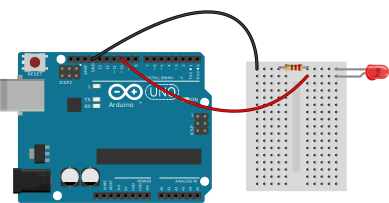

# Rocket Surgery, Airborne IoT
<!-- .slide: class="title" -->

December, 2 2017, BuzzConf 2017 <!-- .element: class="location" -->

Andy Gelme @geekscape, Nick Moore @nickzoic, Andrew Fisher @ajfisher<!-- .element: class="author" -->

Notes:

Hi, my name is Andrew Fisher and I'm joined today by Andy Gelme and Nick Moore.
We are all developers of different types but one thing we all work on in or
out of work is applications of roboitics, IoT and things like machine learning.

Today in our workshop we're going to be looking fundamentally at a set of IoT
related technologies, but we'll be doing it through the medium of rockets because
why not make this fun right?

---

### Building Things
<!-- .slide: data-background="/images/np_glasses.jpg" -->

(CC) <!-- .element: class="attribution" -->
[Andy Gelme](https://github.com/geekscape)

Notes:

This workshop will be hands on building and launching rockets but we have
designed this so you can go as deep as you like.
The main aim is to show you how a bunch of IoT technologies
can be pulled together quickly and cheaply to do a task - in this case, literally
Rocket Science. But if you want to dig into this further then please chat to
one of us during the session and we can walk you deeper into things.

---

## Workshop repository

github.com/nodebotsau/water-rocket<!-- .element class="bigtext" -->

Notes:

Just to quickly point out, there's a bunch of code, tools and resources available
in our project repo so if you want to go to this address then you can start
downloading that. Note that you will need NodeJS to make the various applications
work as well. 

---

## Agenda

1. Why rockets?
2. The rocket stack
3. Building rockets

Notes:

Today we've split things up a bit so we'll very quickly orient you to what
we're doing, how it goes together at a software level and then get stuck into
building and flying these things !!!WEATHER NOTE!!!

---

## Why rockets?

Notes:

Why not fly some rockets? In all seriousness though, we were talking about this
idea that IoT is really important for people to start to understand but at
many layers it can get very impenetrable really quickly. Why we chose rockets
specifically is, besides being fun, there's a multitude of challenges here that
whilst applicable to flying a rocket and getting telemetry off it, are really no
different than having some home automation, or building a connected product.

Additionally, we wanted to show that it's possible, using very inexpensive
and powerful components as well as open source protocols and software to do
really interesting applications both quickly and cheaply. We're going to be
doing literally rocket science for a cost of less than $30 in parts if you
have access to a laptop and a phone.

This has great potential for introducing you to IoT and have some fun while you do it.

---

## The IoT stack

ANDY - Maybe diagram??

Notes:

Run through the stack - 

- MicroPython running on the microcontroller - worth explaining at a high level
what problem mPY is solving (eg high level language on a microcontroller to
prototype quickly and produce connectivity quickly
- MQTT as comms channel - benefit being it can work over any TCP network
- Ground station - mixed technology using python and node tools
- Analysis application - using web tech, primarily nodeJs and JavaScript

- Benefits being able to leverage right tools for the job to work quickly
and prototype well.

---

## Building the rocket

Diagram of parts

Notes:

This is how the bits go together. Show demo rocket and then show running
environment broadcasting data to analysis application (and throw the rocket
around).

---

## Resources:

* github.com/nodebotsau/water-rocket
* mqtt.org
* micropython.org
* nodejs.org

---

### Hardware
<!-- .slide: data-background="/images/arduino_nano.jpg" -->

(CC) <!-- .element: class="attribution" -->
[Phil Farugia](#)

Notes:

Starting with hardware - this is the physical device you're building your thing
around. In our case here we're using Raspberry Pis and Arduinos. Arduinos aren't
naturally connected to the network but they can talk over serial to something that
can - such as a raspberry pi.

We can use other things as well but Arduino is a good place to start for ease of
use and massive community support

---

### Firmware
<!-- .slide: data-background="/images/atmega.jpg" -->

(CC) Flickr<!-- .element: class="attribution" -->
[Oskay](http://www.flickr.com/photos/oskay/2310115216/)

Notes:

Typically our hardware is low spec so we need to program it using C. Sometimes
we can use prebuilt firmware that gets us going - NodeBots uses a firmware called
firmata which abstracts the Arduino hardware into an API that is exposed over
a protocol which means you can interact with it via Javascript or python or
anything that can talk that profile - great for rapid prototyping.

---

### Connectivity
<!-- .slide: data-background="/images/connectivity.png" -->

(CC) Flickr<!-- .element: class="attribution" -->
[Simon Cockell](https://www.flickr.com/photos/sjcockell/4684828794/)

Notes:

This is where our thing becomes an Internet thing so I'm going to focus on this
in a second. There are established protocols for sending data back and forth.

Even HTTP which is not awesome for this is at least very mature and makes your
thing capable of being hit by a browser. Don't use HTTP though because it's heavy
and slow and takes up a lot of space on your Thing. We can use other technologies
such as MQTTm websockets or the like.

---

### Application
<!-- .slide: data-background="/images/robot_love.jpg" -->

(CC) Flickr<!-- .element: class="attribution" -->
[hiperbolica](https://www.flickr.com/photos/hiperbolica/3414999010)

Notes:

Once we have a device that can talk a standard protocol, especially a webby one
then we can hook it up to our wider application. That's one of the reasons that
we use Firmata and MQTT within the nodebots community - they are really well
supported by JavaScript which then means we can hook them up to a whole
stack of other web technologies and get the benefit of the rest of the ecosystem.

This makes prototyping really fast.

---

## Hello, Internet
<!-- .slide: data-background="/images/hello_world.jpg" -->

(CC) <!-- .element: class="attribution" -->
[Arduino](https://arduino.cc)

Notes:

Now I mentioned I was going to talk about messaging and in particular MQTT
in a bit more detail. The way we'll deal with that is using an example and
I'll show you why it is important.

Our thing in this case is going to be really simple - it's the classic
electronics Hello World example of an LED light, however in our case we're
going to make it accessible to the network so you can control it remotely.

---

### Prototype 1 - Arduino + Laptop

* Node Red to do the hard work
* Arduino runs Firmata protocol (same as NodeBots)
* Connection over USB Serial

Notes:

Our first prototype is going to be pretty simple. It's our LED here connected
to a standard Arduino and we'll have that connected to my laptop. In this
case my laptop is providing the connectivity and network access to the arduino
which I'm using over USB and it's talking the firmata protocol.

---

### Install firmata

interchange install StandardFirmata -a uno<!-- .element class="midtext" -->

Notes:

If you haven't already you need to install firmata on your arduino which you
can do with this command here. This is also in the workshop repo readme so
follow that if you haven't. If you have any issues give me a hoy as you all
build the next part.

---

### Circuit

<!-- .element width="70%" style="border: none; background: none; box-shadow: none;" -->

Notes:

Explain circuit.

---

### Programming with node red

Notes:

To make this a quick prototype I'm going to use NodeRed which allows me to
use a browser and some flow based programming to join some parts together.

So here I have my local node-red server running and I can add a UI element
which turns on and off.

Great so I've proven I can make a simple LED turn on and off with some UI
that's a good first step.

---

### Prototype 2 - Message activated light

Notes:

So that works okay but it's very direct. I click a switch and it's all
happening on the devices that are all connected together.

So let's change this up a bit - let's keep the circuit the same but let's
decouple the parts and use a messaging protocol to make all of this work.

What does that look like?

---

### Messaging and MQTT

* Message queue
* Self contained payloads
* May take any data including binary

Notes:

MQTT will be the basis on which we're doing everything. MQTT is a message
queue that was designed for telemetry transport.

It uses messages that are wholly contained payloads. If you've
used message queues before this won't be new at all. The idea is to encapsulate
all the information you need in the payload of a message and then let other
services act upon it if it's of interest.

---

### Brokers

* mosca (npm install mosca)
* mosquitto (apt-get install mosquitto mosquitto-client)
* test.mosquitto.org (public)

Notes:

We need a broker to manage our messages and we have a few options. If you want
lightweight and run in node then mosca will get you going. A more fully featured
server is mosquitto which is great if you're in Linux land and there's a public
version of mosquitto on test.mosquitto.org that you can tinker with if you don't
feel like running your own and don't care about public messaging. Tip you should
care about it but maybe not on a prototype.

---

### PubSub

```
UID_sensor/temp/c
UID_sensor/temp/k
UID_sensor/pressure/pa
UID_sensor/#
```

Notes:

Great, we have messages, they get sent to a broker but how do I send and receive,
well that's where Publication and Subscription come in.

MQTT has the notion of Topics. You can think of a topic as being like a chat room
and it has an address. This first line is a topic that has been set up for the
node ESP_e5 blah temperature celcius topic. This is like a directory
path so you can have containing collections such as here you can see we have
temp and it has sub topics for both celcius and kelvin in this case.

So the node can publish to the Broker on a topic and they are all flexible so you can
have pretty much whatever you want so long as it's a usable string. I haven't
tested emoji but you could give it a go I guess.

Now on the other side, nodes or other actors can subscribe to a topic or in fact
a set of topics. So if I'm interested in the celcius temperature of this particular
node I can subscribe to receive messages from it whenever one is published.

But say I wanted to look at all messages off this node. It might be a weather
station so it's got more data than just temperature. Here I can use a wildcard
which is the hash character. In this case whenever a message that is below the
level of the ESP... gets published, I will receive it as part of my subscription.

Likewise I could use these wildcards to get all temperature values regardless of
the node so I could do things like aggregation or what not.

So pub sub is very flexibile in this regard. If you've used websockets before
this will look fairly familiar.

Now we know the basics of MQTT, let's make our system. If you have the repo
prereqs installed and an arduino nearby you can follow along.

---

### Prototype 2 - Light messaging

- light subscribes to `mytestnode/ic/light` topic
- publish message `on` or `off` (or `1` | `0`) to topic
- wire to UI or other input to trigger

Notes:

This has an LED on it and is subscribed to the lights/state topic. All I need
to do is send it a message of on or off and the lights should turn on or
off.

---

### Node Red set up

Notes:

So here I start an input with the subscription and depending on it's value
I send an on or off message to the GPIO pin on my GPIO node here.

Okay so how do I trigger a message.

Well the quick option is to wire up a UI button in Node Red that sends an on
message or an off message to the light/ic topic. That will work.

---

### MQTT Command line

```
./node_modules/.bin/mqtt_sub -v -h "test.mosquitto.org" -t "mynodetest/#"
mqtt_pub -h "test.mosquitto.org" -t "mynodetest/ic/light" -m "on"
mqtt_pub -h "test.mosquitto.org" -t "mynodetest/ic/light" -m "off"
```

Notes:

Or we can use the mqtt library that you installed to send a message using the
command line which is handy for debugging.

Yay it workds.

So let's all build that.

---

### Prototype 3 - JS version

```
var mqtt = require('mqtt');
var client  = mqtt.connect('mqtt://test.mosquitto.org');

client.on('connect', function () {
    client.subscribe('mynodetest/#');

    if (process.argv[2] == "on") {
        client.publish("mynodetest/ic/light", "on");
    } else if (process.argv[2] == "off") {
        client.publish("mynodetest/ic/light", "off");
    }
});

client.on('message', function (topic, message) {
  // message is Buffer
  console.log(topic, message.toString());
  client.end();
});
```

Notes:

Let's do a version of this in JS. This time we'll write a little command
line application which can send a message to MQTT to control the lights.

Here you can see some simple code, I parse the option of my command line
and then just publish a message on the appropriate topic after connecting to
the MQTT server.

---

### Further examples

* Set up a sensor that logs ambient light or temperature and emits messages
* Ambient light sensor controls the LEDs on or off
* Light when you get a tweet (classic)
* Different coloured light depending on sentiment of tweet (more advanced)


Notes:

There's some more examples that are in the repo for the workshop you can play
with but here's some ideas.

---

## Make Internet Things
<!-- .slide: data-background="/images/tools.jpg" -->

(CC) Flickr<!-- .element: class="attribution" -->
[Peter Hellberg](https://www.flickr.com/photos/peterhellberg/4572432746/)


Notes:

Okay so that's some very basic examples to get you familiar with working with
Node Red and MQTT and doing it in JS as well. There is heaps you can do with
this.

So from here on you'll be creating your own modules or using the data sources
available on the network to create other services.

---

## Resources

* mqtt.org
* github.com/nodebotsau/workshops
* nodebotsau.io
* hackmelbourne.org

Notes:

So if you want to do more and look for more info, here's some places to do so.

---

# NodeBots Internet of Things Workshop
<!-- .slide: class="title" -->

December, 10 2016 <!-- .element: class="location" -->

Andrew Fisher @ajfisher<!-- .element: class="author" -->
