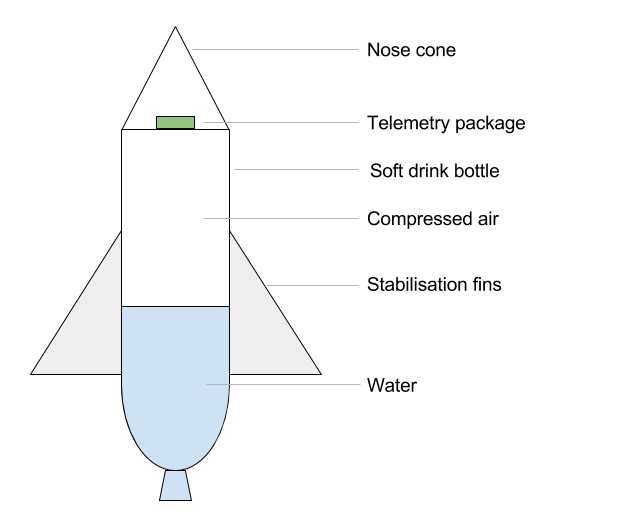

# Rocket Surgery Airborne IoT
<!-- .slide: class="title" -->

BuzzConf 2017<!-- .element: class="location" -->

Andy Gelme @geekscape 
Nick Moore @nickzoic 
Andrew Fisher @ajfisher<!-- .element: class="author multi" -->

Notes:

Hi, my name is Andrew Fisher and I'm joined today by Andy Gelme and Nick Moore.
We are all developers of different types but one thing we all work on in or
out of work is applications of roboitics, IoT and things like machine learning.

Today in our workshop we're going to be looking fundamentally at a set of IoT
related technologies, but we'll be doing it through the medium of rockets because
why not make this fun right?

---

### Building Things
<!-- .slide: data-background="/images/np_glasses.jpg" -->

(CC) <!-- .element: class="attribution" -->
[Andy Gelme](https://github.com/geekscape)

Notes:

This workshop will be hands on building and launching rockets but we have
designed this so you can go as deep as you like.
The main aim is to show you how a bunch of IoT technologies
can be pulled together quickly and cheaply to do a task - in this case, literally
Rocket Science. But if you want to dig into this further then please chat to
one of us during the session and we can walk you deeper into things.

---

## Workshop repository

github.com/nodebotsau/water-rocket<!-- .element class="bigtext" -->

Notes:

Just to quickly point out, there's a bunch of code, tools and resources available
in our project repo so if you want to go to this address then you can start
downloading that. Note that you will need NodeJS to make the various applications
work as well. 

---

## Agenda

1. Why rockets?
2. The rocket stack
3. Building rockets

Notes:

Today we've split things up a bit so we'll very quickly orient you to what
we're doing, how it goes together at a software level and then get stuck into
building and flying these things !!!WEATHER NOTE!!!

---

## Why rockets?
<!-- .slide: data-background="/images/soyuz_rocket.jpg" -->

(CC Flickr) <!-- .element: class="attribution" -->
[NASA Johnson](https://www.flickr.com/photos/nasa2explore/8116894761/)

Notes:

Why not fly some rockets? In all seriousness though, we were talking about this
idea that IoT is really important for people to start to understand but at
many layers it can get very impenetrable really quickly. Why we chose rockets
specifically is, besides being fun, there's a multitude of challenges here that
whilst applicable to flying a rocket and getting telemetry off it, are really no
different than having some home automation, or building a connected product.

Additionally, we wanted to show that it's possible, using very inexpensive
and powerful components as well as open source protocols and software to do
really interesting applications both quickly and cheaply. We're going to be
doing literally rocket science for a cost of less than $30 in parts if you
have access to a laptop and a phone.

This has great potential for introducing you to IoT and have some fun while you do it.

---

## The IoT stack

ANDY - Maybe diagram??

Notes:

Run through the stack - 

- MicroPython running on the microcontroller - worth explaining at a high level
what problem mPY is solving (eg high level language on a microcontroller to
prototype quickly and produce connectivity quickly
- MQTT as comms channel - benefit being it can work over any TCP network
- Ground station - mixed technology using python and node tools
- Analysis application - using web tech, primarily nodeJs and JavaScript

- Benefits being able to leverage right tools for the job to work quickly
and prototype well.

---

## Building the rocket

Notes:

This is how the bits go together. Show demo rocket and then show running
environment broadcasting data to analysis application (and throw the rocket
around).

---

## Resources

* github.com/nodebotsau/water-rocket
* mqtt.org
* micropython.org
* nodejs.org

---

# Rocket Surgery Airborne IoT
<!-- .slide: class="title" -->

BuzzConf 2017<!-- .element: class="location" -->

Andy Gelme @geekscape 
Nick Moore @nickzoic 
Andrew Fisher @ajfisher<!-- .element: class="author multi" -->
